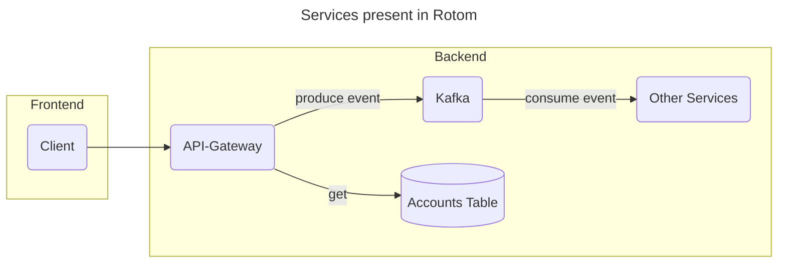
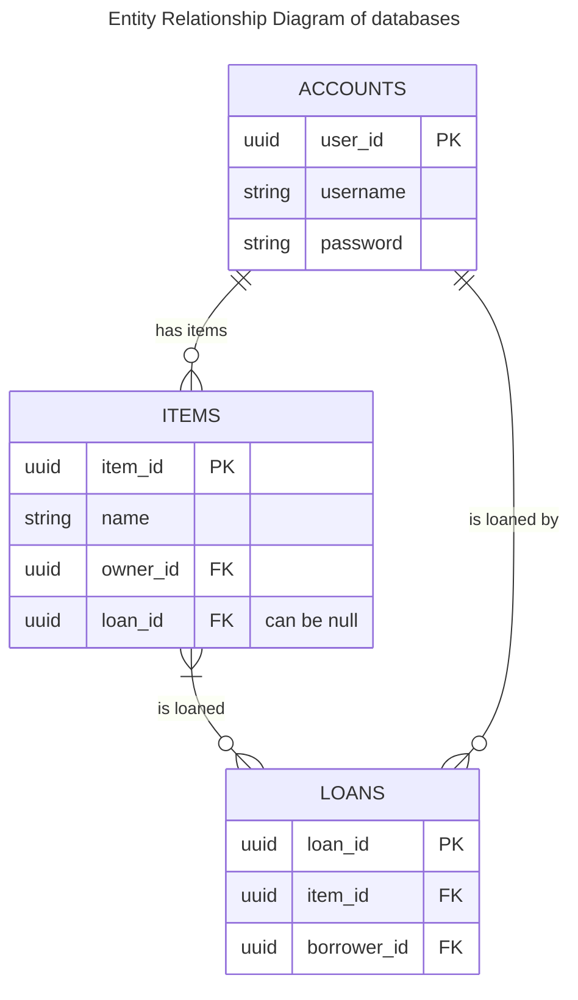

# Architecture

```mermaid
---
title: Services present in Rotom
---
flowchart LR
  subgraph Frontend
    client(Client)
  end
    subgraph Backend
    apigateway(API-Gateway)
    kafka(Kafka)
    accounts[(Accounts Table)]
    services(Other Services)
  end

  client --> apigateway
  apigateway -- produce event --> kafka
  apigateway -- get --> accounts
  kafka -- consume event --> services
    
```

```mermaid
---
title: Entity Relationship Diagram of databases
---

erDiagram
  
  ACCOUNTS {
    uuid user_id PK
    string username
    string password
  }

  ITEMS {
    uuid item_id PK
    string name
    uuid owner_id FK
    uuid loan_id FK "can be null"
  }

  LOANS {
    uuid loan_id PK
    uuid item_id FK
    uuid borrower_id FK
  }

  ACCOUNTS ||--o{ ITEMS : "has items"
  ITEMS }|--o{ LOANS : "is loaned"
  LOANS }o--|| ACCOUNTS : "is loaned by"

```