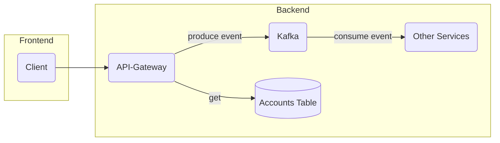

# Architecture
Diagram of services present in Rotom.

```mermaid
flowchart LR
    subgraph Frontend
    client(Client)
    end
    subgraph Backend
    apigateway(API-Gateway)
    kafka(Kafka)
    accounts[(Accounts Table)]
    services(Other Services)
    end

    client --> apigateway
    apigateway -- produce event --> kafka
    apigateway -- get --> accounts
    kafka -- consume event --> services
    
```